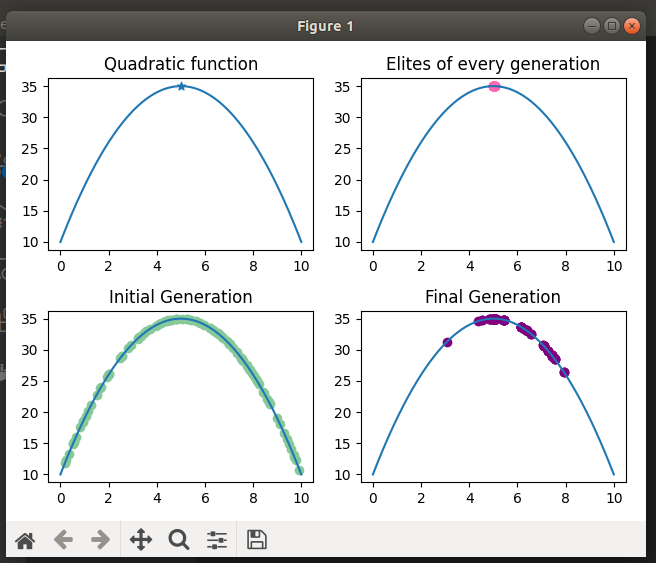

# Genetic Algorithms


  


#### Project Requirements
Given a function _f_ and a domain [a, b], find the maximum value of the function by implementing a genetic algorithm.

---

#### Variables _constants_ class
```python
class Variables:
    def __init__(self, length: int, bounds: Bounds, parameters: Parameters, precision: int) -> None:
        self.length = length
        self.bounds = bounds
        self.parameters = parameters
        self.precision = precision
```
where
```python
Bounds = Tuple[int, int]
Parameters = Tuple[int, int, int]
```
---


#### Genetic representation of a solution
A chromosome will be a binary representation of the *float solution - lower bound*
```python
Chromosome = List[int]
```
A population is a list of Chromosomes
```python
Population = List[Chromosome]
```
---

#### Function to generate new solutions
For generating a new chromosome, we will generate a random uniform number between the upper and lower bound and convert it into binary, then into a list.
```python
# * function that generates chromosome
def generate_chromosome(vars: Variables) -> Chromosome:
    float_number = round(uniform(vars.bounds[0], vars.bounds[1]) - vars.bounds[0], vars.precision)
    float_number = int(float_number * 10 ** vars.precision)
    float_number = format(float_number, '0' + str(vars.length) + 'b')
    binary_chromosome = [int(i) for i in float_number]
    return binary_chromosome
```

For generating a new population, we use the function above in a list comprehension.
```python
# * function that generates population
def generate_population(dimension: int, vars: Variables) -> Population:
    return [generate_chromosome(vars) for _ in range(dimension)]
```

#### Binary to float transformation
Another important and useful function is one that performs the reverse operation of formatting a float number into a binary list.
```python
# * function that returns the float value of the chormosome
def binary_to_float(binary_chromosome: Chromosome, vars: Variables) -> float:
    binary = ''.join([str(item) for item in binary_chromosome])
    float_number = int(binary, 2)
    return round(float_number * 10 ** (- vars.precision), vars.precision)
```


---

#### Fitness Function
Given the function to generate solutions, we have a guarantee that the solutions are between the bounds. Also, having in mind that some chromosomes can mutate and then maybe have a worse solution, the fitness function will verify if the solution is still between the bounds. If yes, it will compute the value of the function _f_.
```python
# * the FITNESS FUNCTION
def fitness(binary_chromosome: Chromosome, vars: Variables) -> float:
    number = binary_to_float(binary_chromosome, vars)
    if number > vars.bounds[1] - vars.bounds[0]:
        return - 1
    return function(number, vars)
```
#### The function _f_
```python
# * quadratic function
def function(x: float, vars: Variables) -> float:
    return vars.parameters[0] * x ** 2 + vars.parameters[1] * x + vars.parameters[2]
```

---

#### Selection Function
This function uses the roulette method to select the intermediate population for a later crossover.
```python
# * the SELECTION FUNCTION
def roulette_selection(population: Population, ret_dimension: int, vars: Variables) -> Population:
    intervals = [0]
    sum = 0
    for i in range(len(population)):
        sum += selection_prob(population[i], population, vars)
        intervals.append(sum)

    intermediate_population = []
    for i in range(ret_dimension):
        u = random()
        index = search(u, intervals)
        
        intermediate_population.append(population[index])
    return intermediate_population
```

The binary search function:
```python
# * the search function
def search(u: float, intervals: List[float]) -> int:
    i = 0
    step = 1
    length = len(intervals)
    while step < length:
        step *= 2
    while step:
        if i + step < length and intervals[i + step] < u:
            i += step
        step //= 2
    return i
```

---
#### Crossover Function
Single point crossover function
```python
# * the CROSSOVER FUNCTION
def single_point_crossover(a: Chromosome, b: Chromosome) -> Tuple[Chromosome, Chromosome]:
    length = len(a)
    if length < 2:
        return a, b
    point = randint(1, length - 1)
    offspring_a, offspring_b = a[0 : point] + b[point : ], b[0 : point] + a[point : ]
    return offspring_a, offspring_b
```

---
#### Mutation Function
```python
# * the mutation function
def mutation(a: Chromosome, mutation_prob: float, show: bool = False) -> Chromosome:
    index = randrange(1, len(a))
    a[index] = a[index] if random() > mutation_prob else abs(a[index] - 1)
    return a
```
---
#### Evolution Function
```python
# * the evolution function
def evolution(vars: Variables, dimension: int, generations: int, crossover_prob: float, mutation_prob: float) -> Population:
    population = generate_population(dimension, vars)
    selected = ceil(crossover_prob * dimension / 2 * 2) # selected for crossover
    members = dimension - selected - 2                  # memnbers going to next gen
    
    show_function(vars)
    show_initial_population(population, vars)
    elite = [ ]

    for i in range(generations):
        population = sorted(population, key = lambda chromosome: fitness(chromosome, vars), reverse = True)
        # todo 1 elitistic selection
        next_generation = population[0 : 2]
        elite.append(binary_to_float(population[0], vars))

        # todo 2 copy
        # * select (1 - cp) * dimension
        next_generation += choices(population = population, k = members)

        # todo 3 crossover
        # * select (cp * dimension) members, pair them and produce offspring
        intermediate_population = roulette_selection(population, selected, vars, i == 1)
        for _ in range(selected // 2):
            parents = random_selection(intermediate_population)
            offspring_a, offspring_b = single_point_crossover(parents[0], parents[1], i == 1)
            next_generation += [offspring_a, offspring_b]

        # todo 3 mutation
        next_generation = [mutation(item, mutation_prob, i == 1) for item in next_generation]
        population = next_generation

    show_elite(elite, vars)
    show_final_population(population, vars)
```

---

#### Example results
For the input below:
```python
dimension: int = 100
bounds: Bounds = (0, 10)
parameters: Parameters = (-1, 10, 10)
precision: int = 3
nr_generations: int = 20
crossover_probability = 0.25
mutation_probability = 0
```

